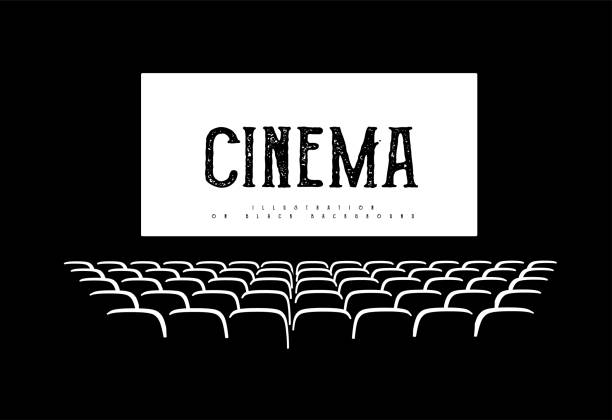

# vie_flix

    
    
    

## feature:

-   login option
-   options [nguonc,kkphim]
-   search compilation mixing options [nguonc,kkphim ,ophim]
-   turn off light,
-   add favorites,
-   add category,
-   save progress,
-   change theme
-   search
-   history search
-   filter movie
-   Feedback
-   copyright , policy
